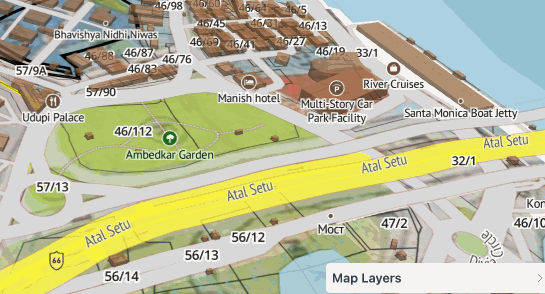

# Introduction 

The amche.in interactive 3d atlas is a free citizen resource to find, create and share various reference maps and plans for the state of Goa, India

The source code is licensed under public domain CC-0 and available at [amche-atlas project](https://github.com/publicmap/amche-atlas/tree/main).

## Available Data Layers

Maps have been collected from various official and non official sources for informational purpose only. Please verify accuracy against the source before use.

**Boundaries**
- Cadastral plots with survey and subdivisions
- Municipal wards
- Urban and rural local bodies
- Assembly and parliamentary constituencies
- Revenue village, taluk, district and state boundaries
- Pincodes
- Micro watersheds

**Regulatory Maps**
- TCP land zoning maps: regional plan and outline development plans
- CRZ coastal zoning maps: coastal zone management plan and regulatory limits, fishing zones and wards
- Protected areas: reserve forests, private forests, notified khazans and wetlands, salt pans, heritage sites,  and zones

**Hazards and disaster management**
- Slope zoning: regulated development slopes and no development slopes
- Landslide risk 

**Physical layers**
- Drainage: rivers, streams and canals

