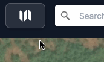
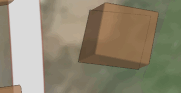
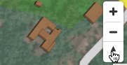

# Atlas controls

The following keyboard shortcuts are available:
- `x` Close the intro modal
- `/` Toggle layer list search

## 🎯 Live location

- Click <button class="geolocate">Geolocate</button> to allow the map to access your device location using GPS.
- Clicking the GPS control again toggles movement lock

## Welcome menu

Use the menu to open this welcome screen at any time.

## Rotate and Tilt 

- Use pressed two finger scroll to tilt the camera for 3D

- Rotate using two fingers or the rotate control

## Move

- Single click and drag to move

- Use two finger scroll or pinch to zoom in and out

## Layers

**Layer Controls**: Use the `Layer List` to toggle different map layers on and off.

**Search**: Look for specific locations using the search functionality in the top navigation.
